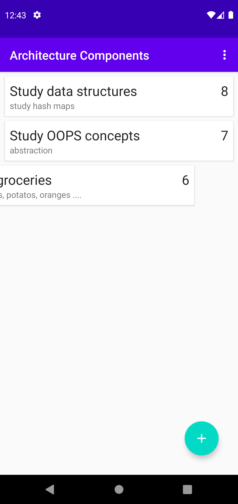

# Android-Architectural-Components
 - In this repository I have built a android application using JAVA and included some architectural component like lifecycle, room database, live data and more.
 - I have used sqlite to presist the data even after closing and opening the application.

 

 
 
 
 
 
 
 

